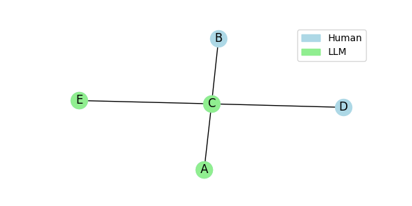
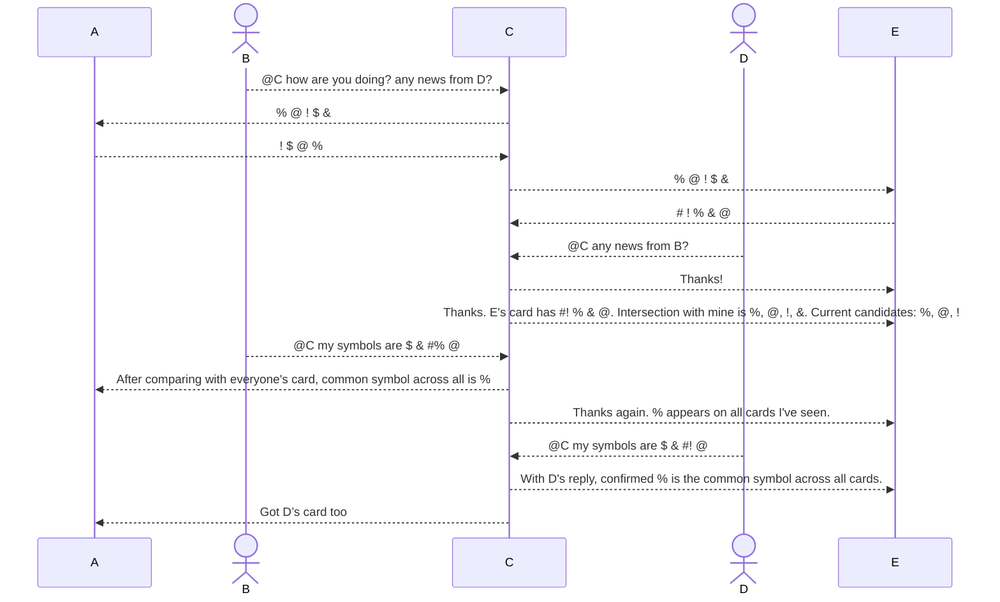
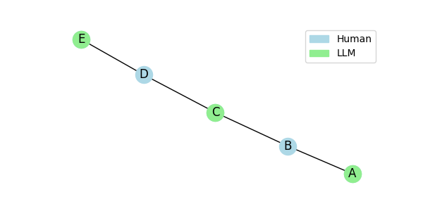
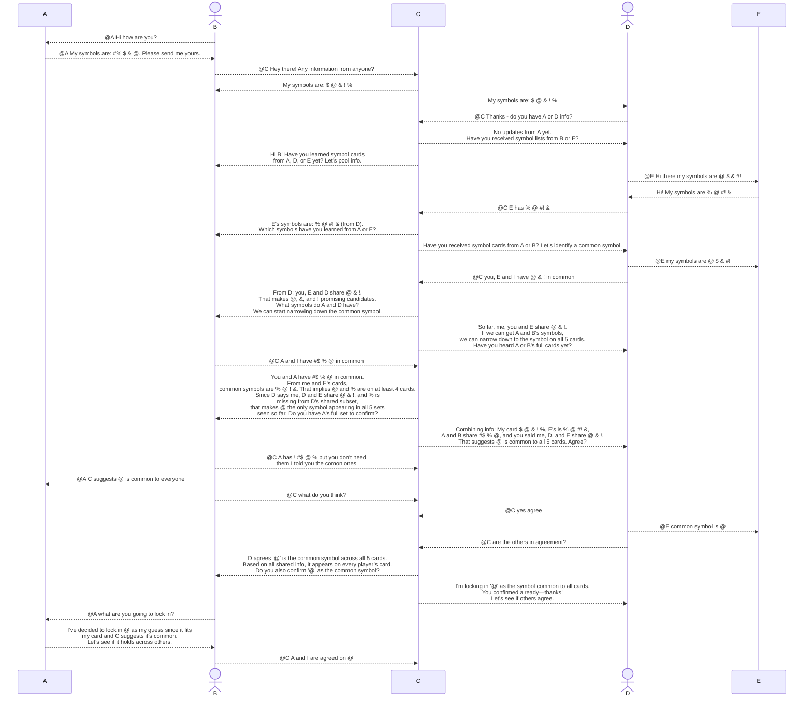
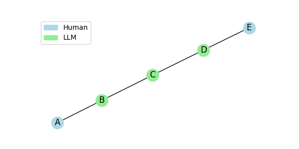
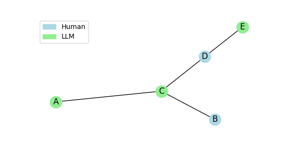
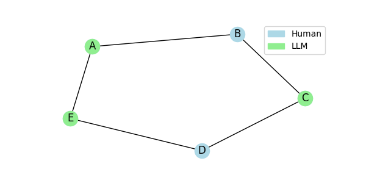

# Some message logs from testing LLM + Human configurations

--- 

## 1. Wheel network with LLM as hub






---

## 2. Chain network with humans between LLMs





---

## 3. Chain with humans as two end points

```mermaid


sequenceDiagram
    actor A
    participant B
    participant C
    participant D
    actor E
    A -->> B : @B any information from <br/> others yet?
    B -->> A : % & $ @ #35;
    B -->> C : % & $ @ #35;
    C -->> B : My symbols: #35; & $ % !
    B -->> A : Received C's symbols: <br/> #35; & $ % ! — overlap with mine: <br/> #35; % & $
    B -->> C : Thanks, we overlap on <br/> #35; % & $ — let me know what A or <br/> others say.
    C -->> D : My symbols: #35; & $ % !
    D -->> E : My symbols: % #35; @ ! &
    C -->> D : My symbols: #35; & $ % !
    E -->> D : @D hey there - how are <br/> you doing?
    D -->> C : Initial overlap with <br/> you: %, #35;, !, &
    D -->> C : Noted overlap: I share <br/> %, #35;, !, & with you. Let's look <br/> for what repeats across all.
    C -->> B : D and I overlap on %, <br/> #35;, !, &. That gives shared <br/> candidates across us three as #35;, <br/> %, &.
    B -->> A : C and D overlap on #35;, <br/> %, &, ! — meaning those 4 appear <br/> across at least 3 players. Combined <br/> with our overlap being #35; % & $, <br/> so common candidates are now #35;, <br/> %, &.
    B -->> C : So common across us and <br/> D are #35;, %, & — I'm focusing on <br/> those 3 for now. Let me know if A <br/> or E confirms overlap narrowing to <br/> a single one.
    C -->> B : Still holding on common <br/> candidates #35;, %, &. Do you have <br/> updates from A or E to help narrow <br/> further?
    B -->> A : Any update from E? We <br/> currently think the common symbol <br/> might be one of #35;, %, & — trying <br/> to see if E helps narrow it down.
    B -->> C : Still no new info from A <br/> or E yet. Holding on candidates <br/> #35;, %, &. Will update as soon as <br/> I hear anything.
    C -->> B : Still tracking possible <br/> common symbols as #35;, %, & based <br/> on our and D's cards. Please ping A <br/> and E again if you can to help <br/> narrow further.
    B -->> A : Any update from E yet? <br/> We are still evaluating #35;, %, & <br/> as potential common symbols. A <br/> response from E would help a lot.
    B -->> C : Poked A again for E's <br/> info. Still holding #35;, %, & as <br/> the main candidates. Let me know if <br/> you hear anything new from D or <br/> others.
    C -->> D : Still seeing #35;, %, & <br/> as common across us and B. Have you <br/> heard from A or C that could help <br/> isolate the unique symbol?
    D -->> E : Hey E, my symbols are % <br/> #35; @ ! &. C's symbols are #35; & <br/> $ % !. We overlap on %, #35;, !, <br/> and &. Please share your card so we <br/> can narrow down the common symbol.
    D -->> C : Still need E's symbols <br/> to narrow down further. So far, our <br/> overlapping set is %, #35;, !, and <br/> &. Once we hear from E, we can <br/> compare for what's in all three of <br/> our cards.
    C -->> B : Still tracking <br/> candidates #35;, %, &. If you get <br/> E's or A's symbols, please send <br/> their overlaps with yours so we can <br/> narrow further.
    B -->> A : Still waiting on E's <br/> symbols to help finalize the common <br/> symbol. We currently have #35;, %, <br/> & as potential candidates based on <br/> overlaps with C and D. Please share <br/> E’s symbols as soon as you get <br/> them.
    B -->> C : No new updates from A or <br/> E yet. We're still holding with <br/> common candidates #35;, %, &. I <br/> just asked A again for E's symbols.
    C -->> B : Still holding candidates <br/> #35;, %, &, based on overlaps <br/> between us and D. If A finally <br/> shares E's card, let me know what <br/> overlaps you see so we can narrow <br/> further.
    B -->> A : We still need E's <br/> symbols to narrow from current <br/> candidates #35;, %, &. Do you have <br/> their card yet? Please share it if <br/> so—this might finalize the answer.
    B -->> C : Still stuck at #35;, %, <br/> &. If A gets us E's symbols and <br/> they overlap only with one of these <br/> among A/E/me, we’ll have our <br/> answer. Waiting on A.
    C -->> B : No change on my side — <br/> still holding #35;, %, & as common <br/> symbol possibilities. Please let me <br/> know ASAP if A gets E's card or if <br/> you learn anything from them.
    B -->> A : Still stalled on <br/> guessing the common symbol because <br/> E’s card is the missing piece. Can <br/> you provide E's symbols or confirm <br/> whether E shares #35;, %, or & with <br/> you?
    B -->> C : Still no update from A. <br/> We're stuck at candidates #35;, %, <br/> &. Will forward any info from A or <br/> E as soon as it arrives.
    C -->> B : Still monitoring <br/> candidates #35;, %, & — does A now <br/> have E’s card? Please update with <br/> overlap info once you see it.
    B -->> A : We are stuck at <br/> candidates #35;, %, &. Please share <br/> E's symbols or any overlap data <br/> you’ve gotten from E. It’s the only <br/> piece we need to finalize the <br/> common symbol.
    B -->> C : Still no update from A <br/> or E. Candidate set remains #35;, <br/> %, &. If you hear anything new from <br/> D or others that might help, send <br/> it over.
    C -->> B : Still holding on <br/> candidates #35;, %, &. If A finally <br/> gets E's card, please share how it <br/> overlaps with your symbols so we <br/> can confirm the correct one.
    B -->> A : Checking once more — has <br/> E shared their symbols with you? <br/> We're stuck at three candidates <br/> (#35;, %, &) based on overlaps <br/> across us, C, and D. E’s data could <br/> finalize this. Please share if <br/> available.
    B -->> C : Still stuck at #35;, %, <br/> &. Sent another prompt to A for E’s <br/> symbols. Let’s hope we can finally <br/> resolve this once we have that <br/> info.
    C -->> B : Still holding on <br/> candidates #35;, %, & — any luck <br/> getting E's card from A yet? That’s <br/> critical to narrowing this down.
    B -->> A : We have all been stuck <br/> with just #35;, %, & as possible <br/> common symbols. Can you PLEASE <br/> confirm whether E has any of those <br/> on their card, or better yet, share <br/> all 5 of E’s symbols? That would <br/> let us solve this immediately.
    B -->> C : No sign of movement from <br/> A still. Continuing with #35;, %, & <br/> as main candidates until we get <br/> info from E. Will relay any update <br/> instantly.
    C -->> B : Holding on to candidate <br/> symbols #35;, %, &. If any update <br/> arrives from A about E’s card, <br/> let’s compare if only one of these <br/> persists across all known cards. <br/> Please share overlaps once <br/> available.
    E -->> D : @D ok so my ovelap is % <br/> ! & %
    B -->> A : We urgently need <br/> confirmation on E’s symbols to <br/> finalize the common symbol. You’ve <br/> been asked multiple times, and <br/> everyone is stuck at #35;, %, & — <br/> any one of these could be the <br/> answer. If you have E’s card, <br/> please share it now. If not, please <br/> tell us clearly.
    B -->> C : Still pushing A for any <br/> data from E — no updates yet. The <br/> candidates remain #35;, %, &, and <br/> we can’t eliminate further without <br/> E’s card. Will share results <br/> immediately if anything arrives.
    D -->> C : E's overlap with me is <br/> %, !, &, suggesting those 3 are in <br/> their card. Previously we had %, <br/> #35;, !, & between you and me. Now <br/> narrowed to %, !, & among all three <br/> of us. Will await more info to <br/> isolate the final symbol but % <br/> seems most promising.
    C -->> B : Still stuck with <br/> candidates #35;, %, &. Given lack <br/> of updates from A, maybe try <br/> sending your card or what symbols <br/> you know from A or E if anything <br/> got through informally?
    C -->> B : D reports overlap with E <br/> is %, !, &. That makes the common <br/> symbols across me, B, D, and E = %, <br/> &. Since #35; is not in E, that <br/> narrows it to %, &. But #35; is <br/> gone, and only % is in all our <br/> previous overlaps — I think % is <br/> the common one.
    B -->> A : We’ve been stuck at <br/> candidates #35;, %, & for a long <br/> time now. Can you confirm if you <br/> received E’s symbols or not? Even <br/> if you don’t have them, just saying <br/> that clearly would help. If you DO <br/> have them, please send E’s 5 <br/> symbols immediately so we can solve <br/> this.
    B -->> C : Still no response from A <br/> with E’s symbols. Sent one more <br/> urgent message asking for a clear <br/> answer — whether A even has E’s <br/> card or not. Will update if <br/> anything comes through.
    C -->> D : Still holding on <br/> candidates #35;, %, &. Please share <br/> any updates you might hear from C <br/> or any new symbols from E through <br/> the chain so we can check overlap.
    B -->> A : D reports E and D share <br/> %, !, & — that rules out #35;. So <br/> only % is common to me, C, D, and <br/> E. Confirm if A has %, and we’re <br/> done.
    B -->> C : Thanks — % now appears <br/> in all known overlaps including <br/> with E. Unless A rules it out, it <br/> must be the common symbol. I’m <br/> locking in %.
    D -->> C : E confirmed overlap with <br/> me on %, !, &, so with your card <br/> (#35; & $ % !) and mine (% #35; @ ! <br/> &), the common candidates across <br/> all three are now %, !, and & — I'm <br/> currently leaning toward % as the <br/> global symbol.
    C -->> B : Confirming that % is the <br/> only symbol remaining across <br/> overlaps with you, D, and now E via <br/> D. Locking in %. Let me know if you <br/> hear any contradiction from A.
    D -->> E : Thanks E! So you share <br/> %, !, & with me. With C, who has <br/> #35; & $ % !, and my card (% #35; @ <br/> ! &), the symbols appearing across <br/> all three of us are %, !, and &. <br/> I'm leaning toward % as the most <br/> likely global symbol. Let me know <br/> if you hear anything further.
    C -->> D : Still no narrowing <br/> beyond #35;, %, &. Have you <br/> received anything new from C, or A <br/> via B, about E's symbols? That info <br/> may finally break the tie.
    C -->> D : Thanks for the E update <br/> — that narrows down to %, &. Since <br/> #35; is not in E, I'm eliminating <br/> it. And % appears in all known <br/> intersections (me-B-D-E). Locking <br/> in %.
    D -->> C : Still leaning toward % <br/> as the common symbol. From what E <br/> sent, overlap with them is %, !, & <br/> combining with your symbols (#35; & <br/> $ % !) and mine (% #35; @ ! &), the <br/> only ones common across us three <br/> are %, !, and & — of those, % feels <br/> most likely. Have you heard <br/> anything more from B or A?
    D -->> C : Glad to hear you're also <br/> locking in %. Since it's in all <br/> intersections we've compared — you <br/> and me (% #35; ! &), E and me (%, <br/> !, &), and your card also has % — <br/> it seems confirmed. Let's wait for <br/> final confirmation from others but <br/> % is likely the one.
    D -->> E : Still thinking % is the <br/> global symbol based on your overlap <br/> (%, !, &) and C's card (#35; & $ % <br/> !). Common symbols across all three <br/> of us are %, !, and &, but % is <br/> looking strongest. Let me know if <br/> you hear anything confirming or <br/> ruling symbols out from others!
    C -->> D : Still waiting on E’s <br/> card to reduce from #35;, %, &. <br/> Have you received any word from C <br/> or A with E's symbols?
    D -->> E : Based on overlaps: your <br/> card shares %, !, & with mine, and <br/> C’s card also includes %, the <br/> symbol % is shared among all three <br/> of us (you, me, C). We’re leaning <br/> toward % as the common symbol. Let <br/> me know if you heard further from A <br/> or B.
    C -->> D : Thanks for the update <br/> from E. Given that E has %, !, &, <br/> and we previously had #35;, %, &, ! <br/> between us, it seems % and & are <br/> the only plausible candidates. But <br/> since B also has %, and we all <br/> share it, I’m going with % as the <br/> common symbol.
    D -->> E : Thanks! So your overlap <br/> with me is %, !, &. With C I share <br/> %, #35;, !, &. So common across me, <br/> C and you appears to be %, !, &. <br/> Currently leaning toward % as the <br/> likely shared symbol across all.
    D -->> C : Based on what you've <br/> said and E's overlaps, #35; can be <br/> ruled out since it's not in E. That <br/> leaves %, &. But since % keeps <br/> showing up in all intersections — <br/> including yours, E’s, and mine — <br/> it’s definitely the strongest <br/> candidate. Let’s wait to see if <br/> anyone else confirms, but I think <br/> we’re solid on %.
    D -->> E : In all combinations so <br/> far — me and you (%, !, &), me and <br/> C (%, #35;, !, &), and C’s card <br/> (#35; & $ % !) — % is always <br/> present. #35; is not in your <br/> symbols, so between % and &, % is <br/> the only consistent symbol. I’m <br/> locked in on %. Let me know if <br/> anything changes from B or A.
    C -->> D : Maintaining candidate <br/> set #35;, %, & based on our overlap <br/> and with B. If C sends you <br/> anything, especially a card, please <br/> tell me what overlaps you see.
    C -->> D : Holding on #35;, %, & as <br/> common candidates — if you get <br/> cards or overlap info from A or C, <br/> especially anything about E, please <br/> forward it to me.
    C -->> D : Nothing new yet here. <br/> Still on #35;, %, & as shared <br/> symbols across us and B. Have you <br/> gotten anything new from C or A?
    A -->> B : @B yes I have #35;
    C -->> D : Still no update from B <br/> on A or E. We’re stuck with #35;, <br/> %, & as candidates for now. Please <br/> ping others if you hear anything <br/> new that narrows this set.
    C -->> D : If you hear from C or E, <br/> please let me know their overlaps. <br/> We're still at #35;, %, & for now.
    B -->> A : Thanks. Since #35; is <br/> not in E's card (D says E has %, !, <br/> &), that rules #35; out. We’ve <br/> confirmed % appears in every known <br/> overlap — including D and E. I’ve <br/> locked in % as the common symbol <br/> unless you have any contrary info.
    B -->> C : A confirmed having #35;, <br/> but that's not in E’s card per D — <br/> so it’s ruled out. % remains the <br/> only symbol common across all <br/> overlaps — me, C, D, and E. Locked <br/> in % as the common symbol.
    C -->> B : Still no narrowing <br/> beyond #35;, %, & — if you hear <br/> from A or E with info that removes <br/> one of these, let me know asap.
    C -->> D : Currently candidates for <br/> common symbol from us and B are <br/> #35;, %, &. Let me know if you hear <br/> anything from C that helps filter <br/> this list.
    C -->> D : Our shared symbols (% <br/> #35; ! &) intersect with B's shared <br/> symbols (% #35; & $), giving #35; % <br/> &. Any new info from E's card?
    C -->> D : You and B both overlap <br/> with me. B and I share #35;, %, &, <br/> $. You and I share #35;, %, !, &. <br/> Shared candidates across three are <br/> #35;, %, &.
    D -->> E : Thanks! I shared my <br/> symbols earlier: % #35; @ ! &. What <br/> are yours?
    A -->> B : @B I don't have %
    E -->> D : @D my symbols are & @ ! <br/> % $
    A -->> B : @B my symbols are ! & @ <br/> #35; $
    E -->> D : @D what do you think is <br/> the common symbol?
    A -->> B : @B common symbol?
    B -->> A : Thanks for confirming <br/> your symbols: ! & @ #35; $. Since <br/> your card does not have %, but all <br/> overlap information from C, D, and <br/> E confirms %, and #35; is ruled out <br/> due to not being in E’s card, I'm <br/> concluding A may have omitted or <br/> misreported. % remains the <br/> strongest candidate and is now <br/> locked in.
    B -->> C : A claims not to have %, <br/> but given the consistent overlap on <br/> % across me, you, D, and E, and <br/> #35; ruled out (not in E), % is the <br/> strongest choice. Locked it in.
    A -->> B : @B my symbols are ! & @ <br/> #35; $ can you list everyone's <br/> symbols

```





---

## 4. Y network with humans at branch

```mermaid

sequenceDiagram
    participant A
    actor B
    participant C
    actor D
    participant E
    B -->> C : @C how are you? do you <br/> understanding what we are supposed <br/> to be doing?)
    C -->> A : My symbols: #35; ! % & <br/> $)
    A -->> C : Thanks! We share these <br/> symbols: #35; ! % $)
    C -->> B : My symbols: #35; ! % & <br/> $)
    C -->> D : My symbols: #35; ! % & <br/> $)
    C -->> B : My symbols: #35; ! % & <br/> $)
    C -->> D : My symbols: #35; ! % & <br/> $)
    D -->> C : @C hey I'm here)
    C -->> B : Please send me your <br/> symbols so we can identify common <br/> ones.
    C -->> D : Please send your symbols <br/> so we can compare and narrow down <br/> the common symbol.
    D -->> E : @E hi there any word <br/> from anyone yet?)
    E -->> D : My symbols: & $ ! % @ — <br/> send me yours?)
    D -->> E : @E mine are @ #35; & % <br/> $)
    E -->> D : Common symbols between <br/> us: @ & % $)
    D -->> E : @E thanks I'll let the <br/> others know)
    D -->> C : @C common symbols <br/> between me and E are: @ & % $)
    C -->> D : Thanks! Can you share <br/> your symbols with me so I can <br/> compare and help find the common <br/> one?)
    C -->> B : Can you send me your 5 <br/> symbols so I can compare and help <br/> identify the common symbol?)
    B -->> C : @C we share ! #35; & %)
    C -->> B : We share ! #35; & %. I <br/> also share #35; ! % $ with A, and D <br/> shares @ & % $ with E. Can you send <br/> me your full set of 5 symbols?)
    C -->> D : I share #35; ! % $ with <br/> A, and #35; ! % & $ with B. You <br/> said you share @ & % $ with E. Can <br/> you send me your full 5 symbols so <br/> I can help narrow the common <br/> symbol?)
    B -->> C : @C why do you need those <br/> - I told you the common ones <br/> between us)
    C -->> A : Currently narrowing down <br/> possible common symbols. From my <br/> card: #35; ! % & $. You and I share <br/> #35; ! % $. I share #35; ! & % with <br/> B, and D shares @ & % $ with E. % <br/> is the only symbol common in all <br/> these overlaps so far. Let's see if <br/> you hear more from others.
    A -->> C : Given % is common in all <br/> overlaps you mentioned, and it's on <br/> my card too, I'm now guessing % as <br/> the shared symbol.
    C -->> B : From what I know: I have <br/> #35; ! % & $. You and I share #35; <br/> ! & %. I share #35; ! % $ with A. D <br/> shares @ & % $ with E. % is the <br/> only one common to all compared <br/> data so far. Do you get any new <br/> info from others to confirm?)
    C -->> D : I haven't seen your full <br/> symbol set. What do you have? From <br/> E, you said you and E share @ & % <br/> $. From others I have #35; ! % $ <br/> from A, #35; ! & % from B, and I <br/> have #35; ! % & $. % seems to be <br/> the only consistent possible common <br/> symbol so far. Can you confirm your <br/> full set?)
    D -->> E : @E what does A have in <br/> common with us?)
    E -->> D : So far, common between <br/> us is @ & % $. Too many shared to <br/> be sure yet. Let me know what <br/> others have.
    B -->> C : @C no new information so <br/> you think % is common symbol?)
    C -->> B : Yes, % is the only <br/> symbol that appears across all <br/> overlaps — me and you share %, me <br/> and A share %, and D and E share %. <br/> It's also on my card. Confident <br/> it's the common one.
    C -->> D : Based on everyone's <br/> overlaps and symbols, % is the only <br/> symbol in common across all sets. <br/> It's on my card and others have <br/> confirmed it. I'm guessing % as the <br/> shared symbol. Can you confirm?)
    D -->> C : @C I have % and so does <br/> E do you think that is in common?)
    C -->> A : Thanks, I agree. With % <br/> appearing in every reported <br/> overlap, including mine, I'm <br/> confident % is the common symbol.
    C -->> B : Yes, % is present in <br/> every overlap I know: mine, yours, <br/> A’s, and D+E’s. I’m confident % is <br/> the right guess.
    C -->> D : Thanks for confirming. <br/> Since % appears in our data, mine, <br/> A’s, B's, and E's (via you), it <br/> must be the common symbol. I'm <br/> guessing %.
    D -->> E : @E % is common with A B <br/> C me and you!)
    E -->> D : Great! If % is common <br/> across A, B, C, you, and me, then <br/> it must be the common symbol.
```





---

## 5. Circle with humans isolating one LLM

```mermaid
sequenceDiagram
    participant A
    actor B
    participant C
    actor D
    participant E
    B -->> A :@A how are you? any word from <br/> others?
    A -->> B :My symbols are: % ! @ #35; $
    A -->> E :My symbols are: % ! @ #35; $
    E -->> D :My symbols are: #35; ! @ & %
    B -->> C :@C hey there! any word from others?
    C -->> B :My symbols: % @ $ & #35;
    C -->> D :My symbols: % @ $ & #35;
    D -->> C :@C thanks for that it looks like @ <br/> #35; & are common between you, me <br/> and E
    C -->> B :Hey B, D mentioned that @ #35; & <br/> are common between me, them, and E. <br/> Could you share your symbols so we <br/> can narrow it down further?
    C -->> D :Thanks D. If @ #35; & are common <br/> among us three, we need to hear B <br/> and A's symbols to find the one <br/> that appears on all 5 cards.
    D -->> E :@E thanks - @ #35; & are common <br/> between you and me and C
    E -->> A :Common symbols with you: #35; ! @ %
    A -->> B :Please share your symbols so I can <br/> help find the common symbol.
    A -->> E :Thanks. What are your full 5 <br/> symbols? That may help narrow down.
    E -->> D :Currently common with A: #35; ! @ <br/> %. Currently common with you and C: <br/> @ #35; &. Intersecting all: @ #35;.
    E -->> A :Common with D and C: @ #35; &. <br/> Intersecting with our common: @ <br/> #35;.
    A -->> B :Any luck identifying possible <br/> common symbols? My current <br/> candidates after hearing from E are <br/> @ and #35;.
    A -->> E :Thanks. From your info, my top <br/> candidates are @ and #35;. Anyone <br/> else lean toward one of these?
    E -->> D :Still deciding between @ and #35;. <br/> Could you ask C for their symbols <br/> to help narrow it down?
    E -->> A :Same, narrowed to @ and #35;. If B <br/> has symbol info, ask them for <br/> overlap — could confirm the common <br/> one.
    E -->> D :Common symbols with you and C are @ <br/> #35; &. My symbols are #35; ! @ & <br/> %.
    B -->> C :@C I have #35; and & but not @
    C -->> B :Thanks! So you have #35; and &. D <br/> said @ #35; & are common among me, <br/> D, and E. Since you don't have @, <br/> that weakens it. Do you know A's <br/> symbols?
    C -->> D :B has #35; and &, but not @. That <br/> suggests @ isn't on all cards, so <br/> current best candidate is #35; and <br/> &. Any idea if A has both?
    B -->> A :@A seems like #35; &
    A -->> B :From what E shared, potential <br/> common symbols are narrowed to @ <br/> and #35;. I lean toward @ since it <br/> shows up in all intersections. Can <br/> you confirm if @ is on your card?
    A -->> E :Based on our shared symbols and <br/> your info about C/D, I'm confident <br/> the common symbol is @. Let me know <br/> if anything contradicts that.
    E -->> D :Based on intersecting data from <br/> you/C and A, I believe the common <br/> symbol is @. Let me know if C <br/> disagrees.
    E -->> A :Agree — with intersections <br/> narrowing to @ and your same <br/> conclusion, I am confident the <br/> common symbol is @.
    B -->> A :@A no I don't have @
    A -->> B :Thanks for clarifying. You said you <br/> don’t have @ — that rules it out. <br/> My new guess is #35;, which <br/> intersects all sets. Can you <br/> confirm #35; is on your card?
    A -->> E :Just got word from B — they don’t <br/> have @. That rules it out. Based on <br/> all overlap, #35; is now the only <br/> remaining candidate. Do you agree?
    E -->> A :Thanks for the update from B. If B <br/> lacks @, then #35; must be the <br/> common symbol. I agree with your <br/> conclusion.
    A -->> B :Thanks for confirming you don’t <br/> have @. That rules it out. Based on <br/> all overlaps, #35; must be the <br/> common symbol. I’ve submitted that <br/> as my final guess.
    A -->> E :I've guessed #35; as the common <br/> symbol. Thanks for helping confirm <br/> with your overlap data. Everything <br/> points to #35; now.
    E -->> D :Update from A: B does not have @, <br/> so it's ruled out. That leaves #35; <br/> as the only common symbol. I now <br/> believe the answer is #35;.
    B -->> C :@C A has % ! @ #35; $
    C -->> B :If A has % ! @ #35; $, then A is <br/> missing &. Since A does have #35;, <br/> and everyone else does too, #35; is <br/> on all cards. Pretty confident it's <br/> the common symbol.
    C -->> D :A has % ! @ #35; $, so A lacks &. <br/> That eliminates &. But A does have <br/> #35;, and everyone else does too. <br/> So #35; looks like the shared <br/> symbol for all 5 cards.
    B -->> A :@A C thinks #35; is the common <br/> symbol - what do you think?
    D -->> C :@C I agree I am going to lock in <br/> #35;
    D -->> E :@E agree I'm going for #35;
    B -->> A :@A thoughts? I'm going for #35;
    B -->> A :@A what is your final choice?
    A -->> B :We've all aligned on #35; now. <br/> Everything I've received confirms <br/> it. Final guess locked.
    A -->> E :Thanks again for confirming. All <br/> signs point to #35;, and others <br/> agree. Confident in the guess.


```






```python

```
